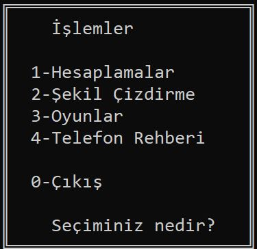
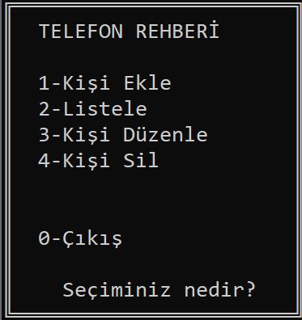

## *_console_project_*

<table width="100%">
  <tr>
    <td align="center">
      
    </td>
    <td align="center">
      <b>Main Menu</b> 
      
    </td>
  </tr>
</table>

 

<table width="100%">
  <tr>
    <td colspan="4" align="center">
       <b>Application on Work</b>  
    </td>
  </tr>
  <tr>
    <td align="center">
       
      Calculator
    </td>
    <td align="center">
       
      Designer
    </td>
    <td align="center">
       
      Games
    </td>
    <td align="center">
       
      Phonebook
    </td>
  </tr>
</table>

## *_stock_project_*

  <video src="https://github.com/canpolatcaner/beginner_projects/releases/download/v1.0.0/retail_automation.mp4" width="800" controls>
  </video>

