
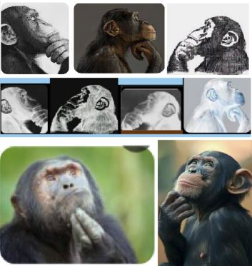

## *_console_project_*

<table width="100%">
  <tr>
    <td align="center">
      
    </td>
    <td align="center">
      <b>Main Menu</b> 
      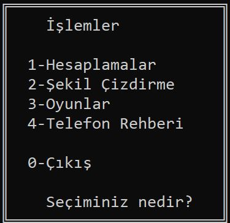
    </td>
  </tr>
</table>

 

<table width="100%">
  <tr>
    <td colspan="4" align="center">
       <b>Application on Work</b>  
    </td>
  </tr>
  <tr>
    <td align="center">
      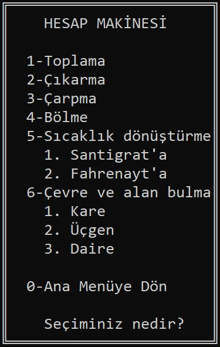 
      Calculator
    </td>
    <td align="center">
      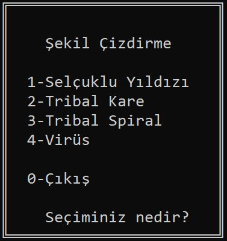 
      Designer
    </td>
    <td align="center">
      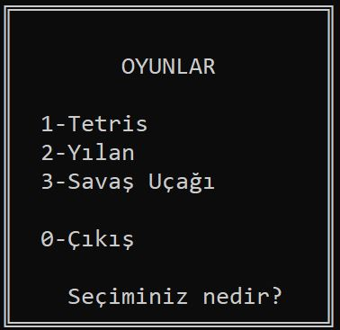 
      Games
    </td>
    <td align="center">
      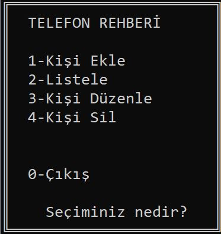 
      Phonebook
    </td>
  </tr>
</table>

## *_stock_project_*

  <video src="https://github.com/user-attachments/assets/bb6d8c59-ff14-4e0f-a6cf-1d8482c4f95a" width="100%" controls title="Retail Automation Software Demo"></video>

## *_new_age_stock_management_project_*

  <video src="https://github.com/user-attachments/assets/df43b963-de93-42bb-b429-dad862ade08b" width="100%" controls title="Retail Automation Software"></video>

## *_pc_distance_control_project_*

  <table width="100%">
  <tr>
    <td colspan="6" align="center">
       <b>Machine Remote Control using Hand Tracking combines a webcam, OpenCv, and MediaPipe or TensorFlow for landmark detection. The versions of both MediaPipe and TensorFlow are available in this project folder.</b>  
    </td>
  </tr>
  <tr>
    <td align="center">
      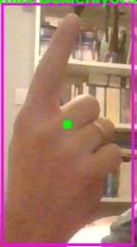 
      Next and/or Down
    </td>
    <td align="center">
      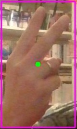 
      Previous and/or Up
    </td>
    <td align="center">
      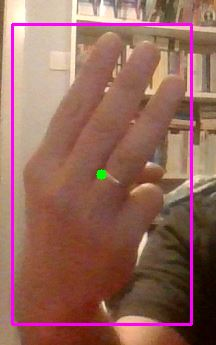 
      Close 
    </td>
    <td align="center">
      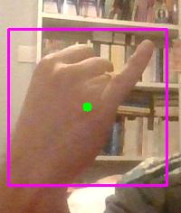 
      Open and/or Enter
    </td>
     <td align="center">
      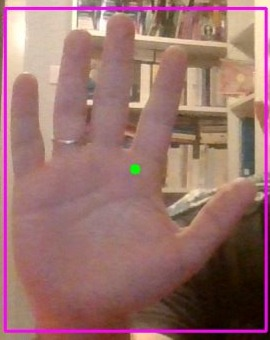 
      Full Screan Mode
    </td>
     <td align="center">
      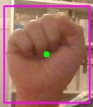 
      Windowed Mode
    </td>
    
  </tr>
</table>

 
    

  <video src="https://github.com/user-attachments/assets/1c3c1cc9-326c-4690-b50f-40c288524885" width="100%" controls title="dist_contr_tensor_hand_landmark"></video>
    

